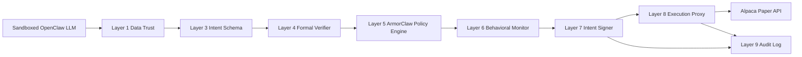

# Architecture

## Boundary

The repo assumes this boundary:

- Outside this repo: sandboxed OpenClaw reasoning layer
- Inside this repo: deterministic enforcement, signing, proxying, and audit

## Flow

## Component Map

- [src/security/data-trust.js](/d:/PROJECTSSS/Claw-Trade/src/security/data-trust.js): allowlisted source checks, prompt-injection pattern blocking, secret redaction.
- [src/security/intent-schema.js](/d:/PROJECTSSS/Claw-Trade/src/security/intent-schema.js): required fields and type-safe trade envelope.
- [python/formal_verify.py](/d:/PROJECTSSS/Claw-Trade/python/formal_verify.py): Z3-backed order, daily notional, and exposure proof checks.
- [src/security/policy-engine.js](/d:/PROJECTSSS/Claw-Trade/src/security/policy-engine.js): runtime rule evaluation from policy JSON.
- [src/security/behavior-monitor.js](/d:/PROJECTSSS/Claw-Trade/src/security/behavior-monitor.js): runaway-loop and baseline drift detection.
- [src/security/intent-signer.js](/d:/PROJECTSSS/Claw-Trade/src/security/intent-signer.js): Ed25519 signing of approved intents.
- [src/execution/execution-proxy.js](/d:/PROJECTSSS/Claw-Trade/src/execution/execution-proxy.js): signature verification, nonce uniqueness, credential isolation.
- [src/security/audit-log.js](/d:/PROJECTSSS/Claw-Trade/src/security/audit-log.js): hash-chained JSONL audit records.

## Secure Defaults

- Dry-run execution until you explicitly choose paper mode
- Fail closed if keys are missing in paper mode
- Fail closed if the signer or nonce checks fail
- Fail closed if the trade exceeds formal or policy limits
